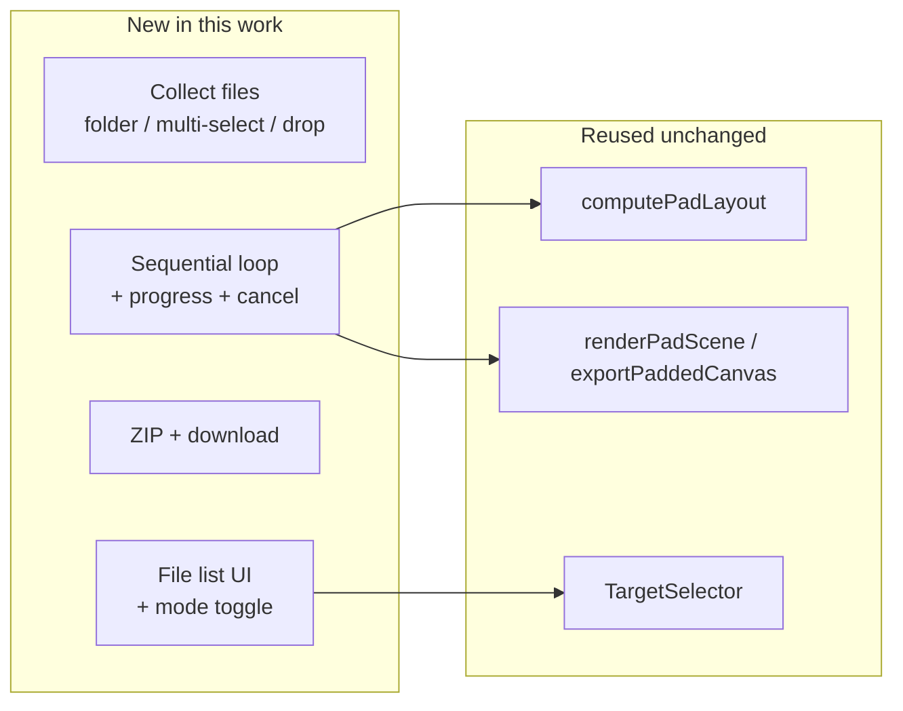
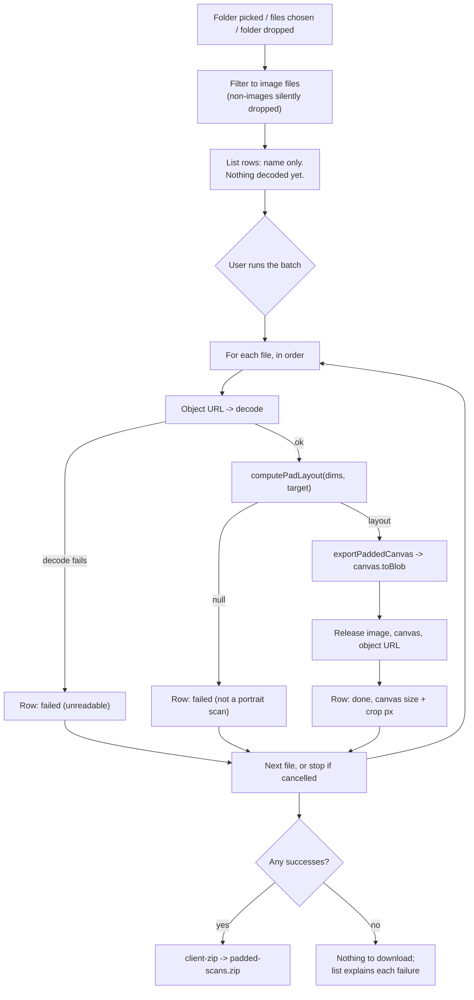
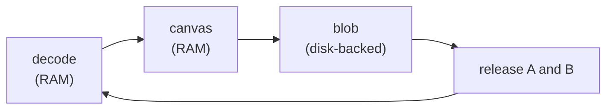
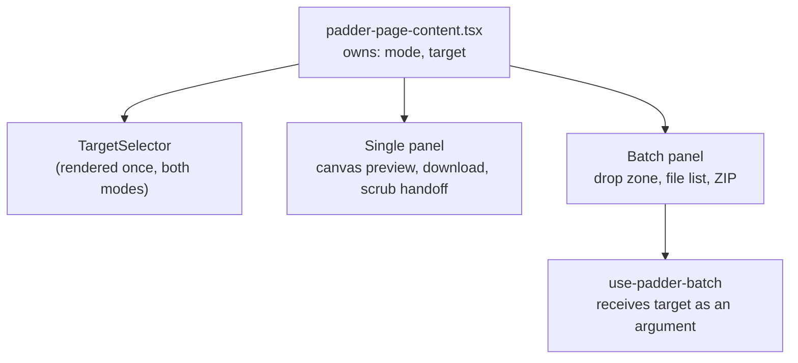

# Mental model: Padder Batch Mode

## The one-sentence version

Batch is the single-scan flow run N times in a loop and zipped — same math, same renderer,
no previews, one target, one download.

## What is actually new

Only the outer ring. The core is untouched.



If a change starts touching `lib/padder-math.ts`, something has gone wrong — batch is not
supposed to alter padding arithmetic at all.

## The pipeline



## Two kinds of rejection

They look similar and are not. Keeping them apart is what makes the failure list useful.

| Input | Treatment | Why |
| --- | --- | --- |
| `.DS_Store`, `notes.txt`, any non-image | Filtered out, never listed | Was never a candidate; listing it is noise |
| Image that will not decode | Listed as failed | The user gave us a scan and it did not work |
| Image that is landscape, square or zero-sized | Listed as failed | `computePadLayout` returns `null`; same rule as single mode |

A failed file never blocks the rest. Export is offered whenever at least one file succeeded.

## Why one file at a time

Peak memory, not speed, sets the design.

A decoded image and a full-size canvas both live in RAM; a PNG blob does not — the browser
backs blobs with disk. So the loop holds exactly one image and one canvas at any moment, and
keeps only blobs between iterations.



Doing all decodes up front would hold N images and N canvases at once — a 50-scan folder at
600 DPI would be gigabytes.

## Why the list is empty at first

Picking a folder records names only. Dimensions, canvas size, crop pixels and status appear
row by row as the run reaches each file.

That makes the file list *also* the progress display — there is no separate progress
component to keep in sync, and choosing a 200-file folder never stalls the page.

## Where the target lives



The batch hook never owns the target. That is what stops the two modes from disagreeing about
which ratio is selected.

## The scrub handoff stops at single mode

Single mode stores `{ width, height, ratioLabel }` so `/padder-scrub` can put a real size into
the Gemini prompt. In a batch the scans have different sizes, so there is no single honest
value to store — batch mode writes nothing and offers no Continue-to-Scrub.

Watch the existing effect in `use-padder-workflow.ts`: it writes whenever a layout exists. It
must not fire while batch mode is active.

## Testability shape

`lib/padder-batch.ts` takes its three DOM-touching steps as injected functions with real
defaults:

```
padBatchFiles(files, target, { decode, render, toBlob, onProgress, isCancelled })
```

Loop order, failure classification, progress reporting and cancellation are then plain unit
tests with fake steps — no canvas mocking, no image decoding, and full branch coverage without
`/* v8 ignore */`.
