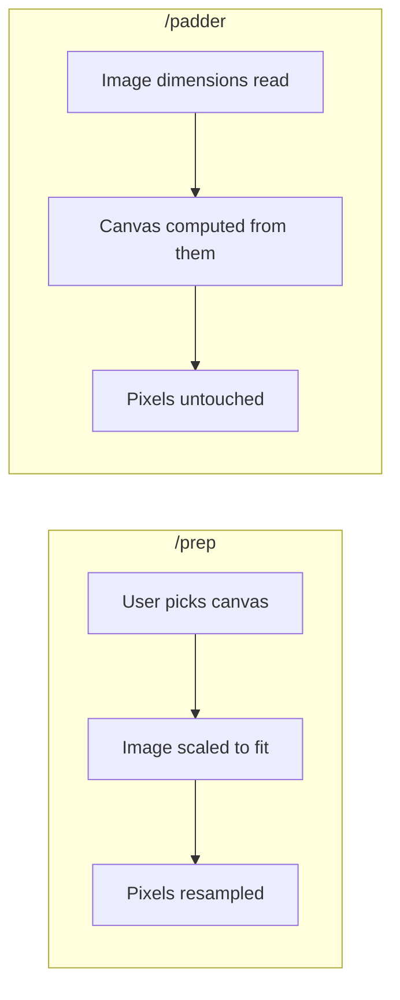
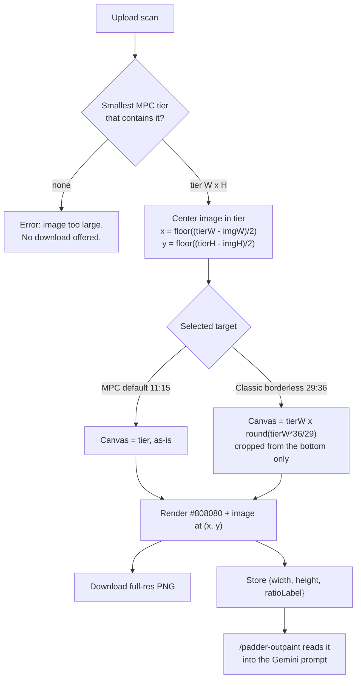
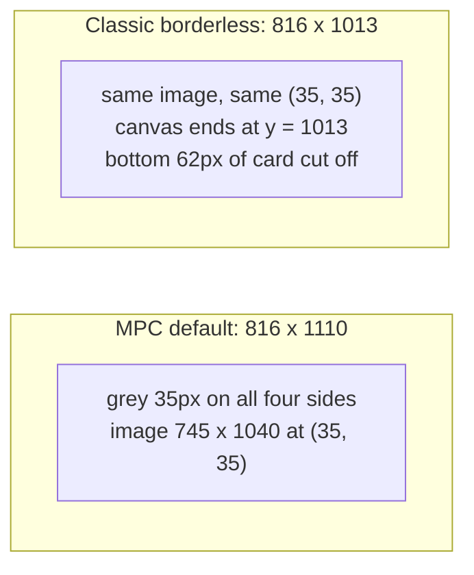
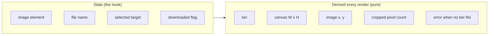
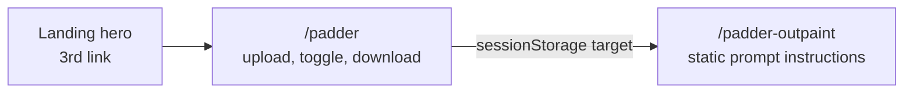

# Mental model: Scryfall Scan Padder

## The one-sentence version

Keep every pixel of the scan; add exactly enough grey around it to make an MPC print-size
canvas — computed, never configured.

## Why it is not just a `/prep` preset

`/prep` scales the image to fit a canvas the user chooses. The padder does the inverse.

Every control that exists to scale or move the image is therefore absent, not merely disabled.

## The pipeline

## The tiers

Same physical MPC card (2.48in x 3.46in, bleed included) at four resolutions:

| DPI | Tier |
| --- | --- |
| 300 | 816 x 1110 |
| 600 | 1632 x 2220 |
| 800 | 2176 x 2960 |
| 1200 | 3264 x 4440 |

Selection rule: the smallest tier that is at least as wide **and** as tall as the image. A
745x1040 Scryfall png and a 672x936 Scryfall large jpg both pick 816x1110.

## The 300 DPI case, concretely

**The bottom cut is intentional.** 29:36 is wider than the tier ratio, and the crop is
specified to come off the bottom. On a 745x1040 scan that removes 62px of real card art. Show
the number, never work around it.

## What holds state, and what does not

No stored position, scale, or canvas size. That is why the pad math is testable with no DOM at
all, and why the padding cannot drift out of sync with the selected target.

## Ratio labels are declared, not computed

`816 x 1110` gcd-reduces to `136:185`. Useless in a Gemini prompt. Each target therefore carries
its own label string — `"11:15"`, `"29:36"` — and that label is what reaches the prompt and the
UI read-out. Never reduce pixel dimensions for display.

## The two routes

Both sit outside the `(steps)` route group and share one small header component; the 3-step
Prep/Outpaint/Merge header does not apply. `/padder-outpaint` ships with **placeholder** prompt
text carrying a TODO — the size and ratio substitution is real, the prose is not final.

## Ways this goes wrong

- Reaching for `/prep`'s hook or canvas component "to save work" — it drags in scale state the
  feature is defined by not having.
- Centering the image vertically inside the cropped 29:36 canvas. The image keeps the position it
  had in the full tier; only the canvas shrinks.
- Downloading the preview canvas instead of a full-resolution render.
- Scaling an oversized image down to fit the largest tier instead of erroring.
