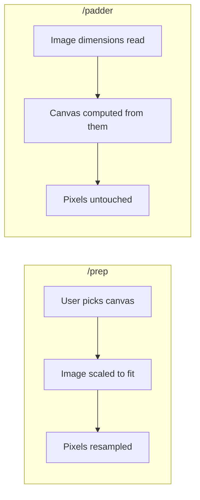
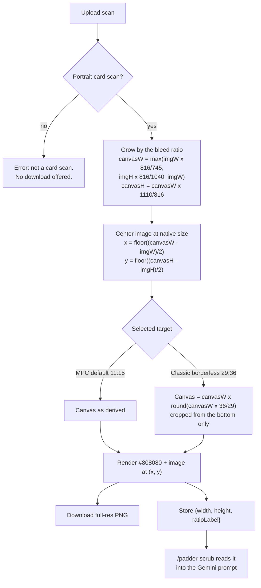
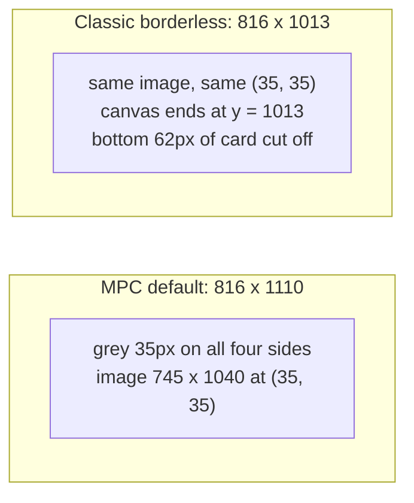
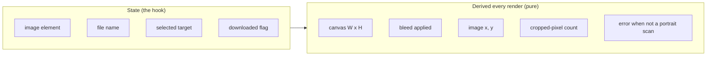
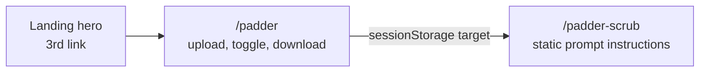

# Mental model: Scryfall Scan Padder

## The one-sentence version

Keep every pixel of the scan; grow it by the MPC bleed *ratio* to get the canvas —
computed from the scan itself, never configured, never a fixed target size.

## Why it is not just a `/prep` preset

`/prep` scales the image to fit a canvas the user chooses. The padder does the inverse.

Every control that exists to scale or move the image is therefore absent, not merely disabled.

## The pipeline

## The bleed ratio

One reference pair fixes everything — the same card at 300 DPI, trimmed and with bleed:

| | Width | Height |
| --- | --- | --- |
| `CARD_REFERENCE` | 745 | 1040 |
| `BLEED_REFERENCE` | 816 | 1110 |

Every canvas is the scan grown by that ratio, so the grey border is proportionally
identical at any resolution:

| Scan | Canvas | Grey pad |
| --- | --- | --- |
| 745 x 1040 | 816 x 1110 | 35 / 35 |
| 672 x 936 | 736 x 1001 | 32 / 32 |
| 1490 x 2080 | 1632 x 2220 | 71 / 70 |
| 1200 x 1680 | 1318 x 1793 | 59 / 56 |

**Why not a list of fixed MPC print sizes?** That was the first design, and it broke on
any scan that did not sit at one of them. A 672x936 Scryfall "large" jpg is a ~268 DPI
card; padding it up to the 300 DPI 816x1110 canvas gave 72px/87px of grey instead of a
bleed. The standard print sizes still fall out of the ratio on their own when the scan
is at a standard DPI — they just are not inputs any more.

## The 300 DPI case, concretely

**The bottom cut is intentional.** 29:36 is wider than the bleed ratio, and the crop is
specified to come off the bottom. On a 745x1040 scan that removes 62px of real card art. Show
the number, never work around it.

## What holds state, and what does not

No stored position, scale, or canvas size. That is why the pad math is testable with no DOM at
all, and why the padding cannot drift out of sync with the selected target.

## Ratio labels are declared, not computed

`816 x 1110` gcd-reduces to `136:185`. Useless in a Gemini prompt. Each target therefore carries
its own label string — `"11:15"`, `"29:36"` — and that label is what reaches the prompt and the
UI read-out. Never reduce pixel dimensions for display.

## The two routes

Both sit outside the `(steps)` route group and share one small header component; the 3-step
Prep/Outpaint/Merge header does not apply. `/padder-scrub` ships with **placeholder** prompt
text carrying a TODO — the size and ratio substitution is real, the prose is not final.

## Ways this goes wrong

- Reaching for `/prep`'s hook or canvas component "to save work" — it drags in scale state the
  feature is defined by not having.
- Centering the image vertically inside the cropped 29:36 canvas. The image keeps the position it
  had in the full canvas; only the canvas shrinks.
- Downloading the preview canvas instead of a full-resolution render.
- Reintroducing a list of fixed canvas sizes and padding the scan up to the nearest one. That
  is the bug this design exists to fix: it inflates the grey on any scan that is not already at
  one of those resolutions.
- Scaling the scan to match a canvas. The scan's resolution is the output resolution.
